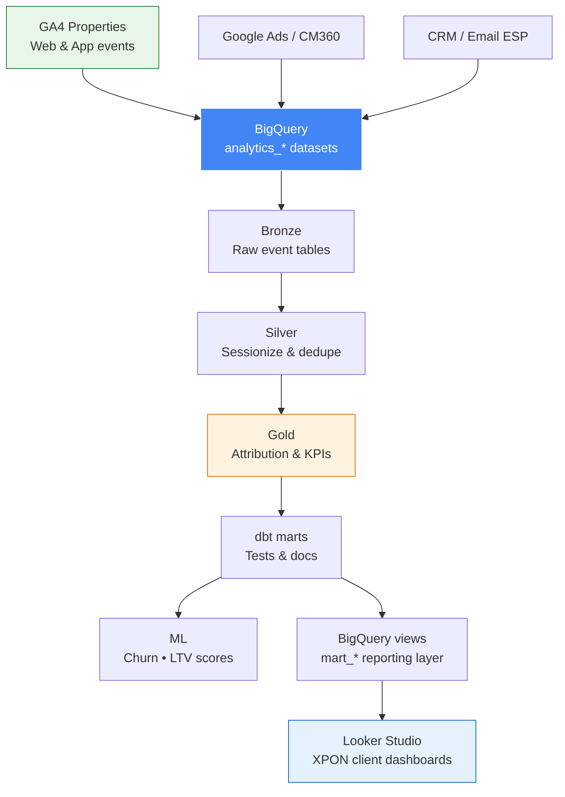

# XPON Multi-Channel Marketing Analytics

> Marketing intelligence platform for **XPON** (Australia) — deep integration with **Google Analytics 4**, **Google Cloud Platform** (BigQuery, Pub/Sub, Dataflow), and multi-channel campaign data for Australian enterprise clients.

XPON implements and operates GA / GCP analytics stacks for clients across Australia. This repo models the **end-to-end pipeline**: GA4 & ads exports → GCP landing → attribution marts → churn/LTV ML → **Looker Studio** (Google Data Studio) client dashboards on BigQuery.

## Overview

- **GA4** event export & BigQuery daily/sharded tables
- **GCP**: BigQuery (warehouse), Pub/Sub (streaming), optional Dataflow/Beam transforms
- Multi-channel ingestion: email, paid search, social, web, CRM
- Attribution: first/last/linear and ML-assisted credit
- Churn & LTV scoring with confidence intervals
- Campaign ROI, CAC, and A/B test significance
- **BI**: **Looker Studio** reports connected to curated BigQuery marts (XPON standard delivery pattern)

## Tech Stack

| Layer | Technology |
|-------|------------|
| **Web analytics** | Google Analytics 4, GA4 BigQuery Export |
| **Cloud** | GCP BigQuery, Cloud Storage, Pub/Sub |
| **Pipeline** | Python 3.10+, Pandas, PySpark (optional) |
| **Warehouse modeling** | dbt (BigQuery adapter) |
| **ML** | scikit-learn, XGBoost |
| **BI / dashboards** | **Looker Studio** (Google Data Studio) on BigQuery |
| **Orchestration** | Airflow / Cloud Composer patterns |
| **CI/CD** | GitHub Actions |

## Architecture



## Key Features

| Feature | Description |
|---------|-------------|
| **GA4 → BigQuery** | Scheduled export, event param flattening, user pseudo-ID stitching |
| **GCP-native ELT** | Partitioned tables, cost-aware clustering, IAM service accounts |
| **Multi-touch attribution** | Channel credit across AU campaign portfolios |
| **Looker Studio delivery** | XPON-branded templates: CAC, ROAS, funnel, channel mix (BQ connector) |

## Project Structure

```
├── attribution.py         # Multi-touch attribution logic
├── ml_models.py           # Churn / LTV models
├── config.py              # Settings (GCP, BQ dataset)
├── bi/looker_studio/      # Looker Studio + BigQuery mart definitions
│   ├── README.md          # Report layout & connection guide
│   └── bigquery_marts.sql # Reporting views for Looker data sources
├── dags/                  # Airflow DAGs (optional)
└── tests/
```

## Quick Start

```bash
git clone https://github.com/willtran112358/xpon-multi-channel-mkt-analytics.git
cd xpon-multi-channel-mkt-analytics
python -m venv .venv && source .venv/bin/activate   # Windows: venv\Scripts\activate
pip install -r requirements.txt
pytest tests/ -q
```

### Looker Studio (BI)

1. Deploy dbt/BigQuery marts (see `bi/looker_studio/bigquery_marts.sql`).
2. In Looker Studio: **Create → Report → BigQuery** → select `xpon_marketing.mart_campaign_performance` (and related views).
3. Use XPON template pages: executive summary, channel attribution, campaign drill-down.

Details: [bi/looker_studio/README.md](bi/looker_studio/README.md)

## Configuration

Set GCP project and GA4 property in `.env`:

- `GCP_PROJECT_ID`
- `GA4_PROPERTY_ID`
- `BIGQUERY_DATASET` (e.g. `xpon_marketing`)

---

**Portfolio demo** — synthetic/sample data only; no XPON or client PII.

**Will Tran** — [@willtran112358](https://github.com/willtran112358)
